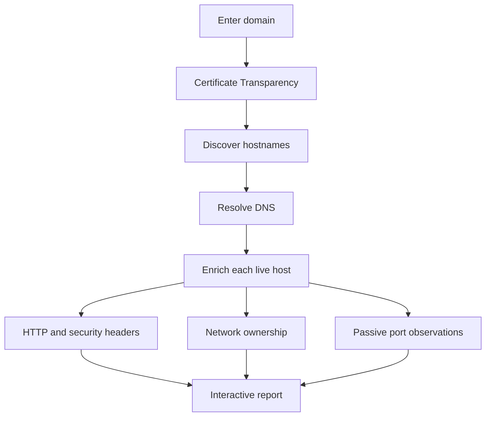

# Domain Scout

Domain Scout is a lightweight external asset-discovery dashboard built on Cloudflare Workers. Enter a domain to discover certificate-listed subdomains, resolve their current DNS records, inspect web responses, identify network ownership, and review previously observed public ports.

**Live site:** [domain-scout.botonis-bill.workers.dev](https://domain-scout.botonis-bill.workers.dev)

> Domain Scout is intended for domains you own or are authorized to assess. It performs passive discovery and limited HTTP/HTTPS availability checks; it does not run a conventional active port scan.

## Features

- Subdomain discovery from multiple Certificate Transparency sources
- Current `A`, `AAAA`, `CNAME`, `MX`, `NS`, `TXT`, and `CAA` records
- IPv4 and IPv6 resolution
- Cloudflare-proxy detection
- Passive, previously indexed port information
- Human-readable port and service names
- HTTP/HTTPS status, page title, final URL, and response time
- Basic server and technology hints
- Security-header inspection
- Public network ownership and registration information through RDAP
- Expandable details for every resolving hostname
- Live scan progress and elapsed time
- JSON and CSV report exports
- Responsive, dependency-free interface

## How it works



Discovery and enrichment are separated into individual requests. This provides meaningful progress feedback and avoids placing every external lookup into one Cloudflare Worker invocation.

## Data sources

| Source | Used for |
|---|---|
| [crt.sh](https://crt.sh/) | Certificate Transparency hostname discovery |
| [Cert Spotter](https://sslmate.com/certspotter/) | Secondary Certificate Transparency source |
| [Cloudflare DNS over HTTPS](https://developers.cloudflare.com/1.1.1.1/encryption/dns-over-https/) | Current DNS resolution |
| [Shodan InternetDB](https://internetdb.shodan.io/) | Previously indexed ports for public IP addresses |
| [RDAP](https://about.rdap.org/) | Public IP registration and network ownership information |

No API keys are embedded in the project.

## Understanding the results

Domain Scout provides an external, point-in-time view. Results should be treated as leads for investigation, not as proof that a system is vulnerable.

- Certificate Transparency may contain expired or historical hostnames.
- A hostname can exist without having appeared on a public certificate.
- Passive port information may be incomplete or outdated.
- Technology detection is heuristic and may be incorrect.
- A missing security header is an observation, not automatically a vulnerability.
- Cloudflare-proxied addresses normally identify Cloudflare rather than the origin server.
- Sites may block or behave differently toward automated HTTP requests.

`None indexed` means the passive source returned no known ports. It does **not** guarantee that every port is closed.

## Safety controls

The Worker limits enrichment to the submitted domain and its subdomains. It also:

- Rejects direct IP-address input
- Rejects private, loopback, link-local, and other non-public destinations
- Allows only HTTP and HTTPS web checks
- Restricts redirects to the scanned domain
- Applies request timeouts
- Limits downloaded HTML used for title and technology detection
- Caps hostname discovery results

These controls reduce the risk of using the public Worker as an SSRF or unrestricted scanning proxy.

## Project structure

```text
Domain-Scout/
├── lib/
│   └── scanner.mjs       # Discovery, DNS, web and enrichment logic
├── public/
│   ├── index.html        # Application interface
│   ├── app.js            # Browser behavior and report rendering
│   └── styles.css        # Responsive visual design
├── src/
│   └── worker.js         # Cloudflare Worker API and asset routing
├── tests/
│   └── scanner.test.mjs  # Automated scanner tests
├── dev-server.mjs        # Dependency-free local development server
├── package.json
└── wrangler.jsonc        # Cloudflare Worker configuration
```

The older `functions/` directory is only relevant to a traditional Cloudflare Pages Functions deployment. The current Workers deployment uses `src/worker.js`.

## Run locally

### Requirements

- Node.js 20 or newer
- npm, included with Node.js

Clone the repository and enter its directory:

```bash
git clone https://github.com/deckeeper/Domain-Scout.git
cd Domain-Scout
```

Run the automated tests:

```bash
npm test
```

Start the local development server:

```bash
npm run dev
```

Open [http://127.0.0.1:8788](http://127.0.0.1:8788).

The dependency-free local server is useful for the core interface and `/api/scan`. For exact Cloudflare Worker behavior, use Wrangler:

```bash
npx wrangler dev
```

## Deploy to Cloudflare Workers

The production deployment is connected to GitHub. Every push to the production branch triggers a new Cloudflare build.

The Worker uses:

- `src/worker.js` as its server-side entry point
- `public/` as its static asset directory
- The `ASSETS` binding to serve the interface
- `/api/scan` for domain discovery
- `/api/details` for per-host enrichment

The expected `wrangler.jsonc` configuration is:

```jsonc
{
  "$schema": "node_modules/wrangler/config-schema.json",
  "name": "domain-scout",
  "main": "src/worker.js",
  "compatibility_date": "2026-09-01",
  "observability": {
    "enabled": true
  },
  "assets": {
    "directory": "./public",
    "binding": "ASSETS",
    "run_worker_first": [
      "/api/*"
    ]
  }
}
```

To deploy manually from an authenticated terminal:

```bash
npx wrangler deploy
```

## Public deployment considerations

The interface is safe to publish, but every scan consumes Worker requests and calls public upstream services. Before promoting a heavily used deployment, consider adding:

- Cloudflare Turnstile
- Rate limiting for `/api/scan` and `/api/details`
- Short-lived caching for repeated scans
- A clear acceptable-use notice

Public providers may throttle requests, change response formats, or become temporarily unavailable. Domain Scout handles many upstream failures gracefully, but complete availability cannot be guaranteed.

## Development

Run tests after changing scanner behavior:

```bash
npm test
```

The project intentionally avoids a frontend framework and runtime dependencies. Most changes can be made directly in the browser JavaScript, CSS, Worker entry point, or scanner module.

## Responsible use

Use Domain Scout only against infrastructure you own or have explicit permission to assess. Do not interpret or advertise its output as a formal penetration test, vulnerability assessment, or guarantee of security.
